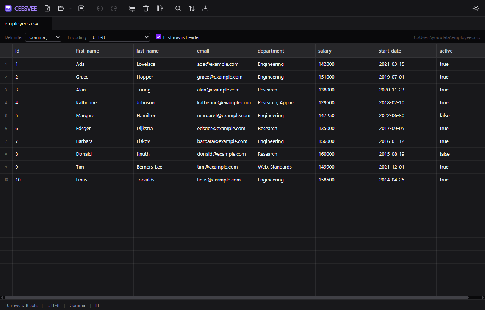

<div align="center">


# CEESVEE

**A fast, open-source CSV / delimited-file viewer and editor.**

Open a million-row file in a blink, edit it like a spreadsheet, and save it back
without surprises. Built with [Tauri](https://tauri.app), Rust, and React.

[](https://github.com/soldforaloss/ceesvee/actions/workflows/ci.yml)
[](LICENSE)
[](https://tauri.app)



</div>

---

## Why CEESVEE?

Most spreadsheet apps choke on large CSVs, mangle your delimiters, or silently
"helpfully" reformat your data. CEESVEE is built around one priority: **be fast
and faithful on large, real-world delimited files.**

- ⚡ **Fast on huge files.** The dataset lives in Rust; the UI is canvas-rendered
  and only ever fetches the rows it's about to draw. Opening and smoothly
  scrolling a **1,000,000-row / 100 MB+** file is a core requirement, not a
  stretch goal.
- 🧭 **Faithful round-trips.** Parse → edit → save preserves your data. You
  control delimiter, encoding, quoting, line endings, and BOM on export.
- ⌨️ **Keyboard-first.** Excel-style navigation and shortcuts so it feels
  instantly familiar.

## Features

**Viewing**

- Open CSV / TSV / and other delimited files in a virtualized, spreadsheet-style grid.
- **Multi-GB files** open read-only against a streaming record index instead of
  being loaded whole — browse, find, filter, export, profile, and compare with
  bounded memory, then **Convert to editable** when you need to change cells.
- Open **compressed files** — `.csv.gz` and `.zip` archives (with an entry
  chooser) — and export back to gzip. Decompression-bomb guards included.
- **Open JSON / JSON Lines** — import an array of objects, an array of
  arrays, NDJSON, or a record array at a JSON Pointer, with a preview that
  detects the shape, infers columns, counts missing vs explicit-null cells,
  and lets you flatten, preserve, join, or explode nested objects and
  arrays. JSON Lines opens read-only with bounded memory.
- Auto-detect the **delimiter** (comma, tab, semicolon, pipe) with a manual /
  custom override — plus an **advanced import** for preambles, comment
  lines, custom quoting/escaping, multi-row headers, and footers.
- Auto-detect the **encoding** (UTF-8, UTF-16 LE/BE, Windows-1252 / Latin-1) with
  an override, plus correct **BOM** handling.
- "First row is header" toggle with a frozen header row.
- Per-column **type detection** (number / date / bool / text) shown as header
  badges, with numeric columns right-aligned and a column-summaries panel
  (count, blanks, unique values, min / max / mean).
- Hide, **pin**, and drag-reorder columns; auto-fit widths; wrap long text.
- Tabs for multiple open files, a recent-files list, and **drag-and-drop** to open.
- **Follow mode** — tail a growing CSV log live (read-only), with
  pause/resume, new-row filtering, and rotation/truncation detection.
- Status bar with row/column counts, encoding, delimiter, line endings, and live
  selection stats (count, sum, average, min, max).

**Editing**

- Inline cell editing with Excel-like keyboard navigation.
- **Typed edit validation** — when a column has a declared schema, cell
  edits are checked against its logical type: strict mode blocks an
  invalid edit with an inline reason, advisory mode accepts it and records
  a retrievable issue.
- **Multiline / raw cell editor** (`F2`) with an Escaped view that reveals
  newlines, tabs, and invisible characters — safe to inspect and copy.
- **Record form** (`Ctrl+Shift+R`) — edit one record at a time in a dockable
  form built for very wide / record-oriented tables: schema-aware field labels
  (data-dictionary display names and descriptions when documented), type and
  semantic badges, autosizing multiline editors, a raw-vs-formatted toggle, a
  null-token-vs-blank control where the schema declares tokens, and per-field
  validation that surfaces strict blocks, advisory warnings, and previously
  recorded advisory issues distinctly. A changed-field indicator, copy, and
  jump-to-grid-column sit on each field; navigate previous / next / go-to
  across the _visible_ records (filters and view sorts respected). A draft
  commits every changed field as one undo step; strict-invalid drafts cannot
  commit; unsaved drafts prompt on navigation (or auto-save, per preference).
  Fields can be grouped, hidden, and shown compact or comfortable; indexed
  documents open the form read-only. The header carries a row bookmark strip
  (star, flag, tags, and a row note) and every field shows a cell-note
  indicator you can click to add or edit its note — the same annotations as the
  grid and the annotations panel, so a note taken in the form appears
  everywhere.
- Insert / delete / reorder rows; insert / delete / rename / reorder columns.
- Multi-cell selection and **Excel-compatible copy/paste** (TSV on the clipboard).
- **Copy As** JSON / Markdown / SQL / CSV variants, and **Paste Special** with
  transpose, skip-blanks, pattern repeat, and insert-as-rows — all previewed.
- **Undo / redo** backed by a Rust undo stack (Ctrl+Z / Ctrl+Y).
- **Save / Save As** with explicit export options: delimiter, encoding, quoting
  style, line endings (LF/CRLF), and BOM.
- **Scoped & split export** — export everything, the visible (filtered) rows,
  selected rows / columns, or a cell range; optionally split the output by row
  count, approximate file size, or a column's values (one file per group),
  with an optional JSON manifest recording row counts and SHA-256 hashes.
- **Export as JSON** — write any export scope as an array of objects, an
  array of arrays, or JSON Lines; typed columns emit real numbers and
  booleans, nested objects rebuild from dotted-path columns, and duplicate
  output paths are rejected before writing.

**Reliability**

- **Atomic saves** — Save streams through a temporary file that is fsynced and
  renamed into place, so a crash or a full disk can never leave a half-written
  file behind; optional single or rolling `.bak` backups.
- **Data-fidelity diagnostics** — a cancellable background scan reports import
  damage (malformed bytes, ragged records with their source line numbers),
  replacement characters, mixed-type columns, blank-heavy columns, edge
  whitespace, duplicate or empty headers, and more — each with samples,
  jump-to-cell, and one-click "filter to affected rows".
- **Reopen with settings** — change delimiter, encoding, or the header toggle
  against a live preview of how the file would re-read (including exactly
  which cells change) and apply only with explicit confirmation. Dirty
  documents are saved or explicitly discarded first, never silently reparsed.
- **External-change detection** — CEESVEE fingerprints the file on disk and,
  when another program changes it, offers reload / ignore / save-as / open the
  disk copy side by side instead of clobbering anything.
- **Quit protection** — closing the window with unsaved tabs prompts to save
  all (aborting if any save fails), discard all, or cancel.
- **Crash recovery** (opt-in) — an append-only local edit journal that
  replays your unsaved work after a crash, without ever touching the
  source file. Changed sources recover as copies; journals clean up on
  save and close.
- Exports to legacy encodings (e.g. Windows-1252) are checked up front and
  blocked with the exact offending cells listed — nothing is ever substituted
  silently.
- Saves, exports, and every heavy scan run as cancellable background jobs with
  progress in the status bar, so the grid never blocks.

**Navigate & analyze**

- **Command palette** (`Ctrl/Cmd+K`) — fuzzy-search and run every action from
  the keyboard: commands, go to row/cell, recent files, tab switching. Every
  shortcut is customizable via the built-in shortcut editor.
- **Named views** — save non-destructive combinations of filter, view-only
  sort, hidden/pinned/reordered columns, widths, and wrap per file; views
  survive renames via stable column IDs and restore when you reopen the file.
- **Conditional highlighting** — decorate cells and rows with prioritized,
  view-only rules (equals / not-equals, contains, regex, numeric and date
  ranges, blank / null / invalid, duplicate values, diagnostic issues,
  cross-column violations, outliers, and changed-since-save) in theme-aware
  semantic tones that stay readable in light and dark. Each rule targets the
  cell, its whole row, or selected columns; overlaps resolve by priority into
  one winning decoration per cell, flattened server-side so only the visible
  window crosses to the grid and a million-row scroll stays smooth. An
  "explain" query lists every rule matching a cell in priority order, and
  highlighting never dirties the document or changes exports. Rules persist in
  named views and file profiles, and a match report exports to JSON or CSV.
- **Filter rows** with an advanced query builder — nest AND/OR groups of
  conditions (contains, equals, numeric comparisons, is-empty, regex, and
  more). The status bar shows "N of M rows" with one-click clear; filtering is
  a non-destructive view, and Save always writes every row.
- **Column explorer** — a per-column profiling panel: type distribution,
  blanks, distinct counts (exact, or estimated once cardinality explodes), top
  values, numeric quartiles, date extremes, and text-length stats — over all
  rows or just the visible ones, with click-to-filter straight from the panel.
- **File profiles** — save delimiter / encoding / header choices, expected
  columns, and validation rules (required, unique, type, regex, numeric range)
  under a name matched to file patterns; matching files suggest — or with
  opt-in, auto-apply — the profile, and a validation report checks any
  document against it.
- **Fuzzy value clustering** — group spelling/punctuation/case variants
  (fingerprint, n-gram, Levenshtein, Jaro-Winkler) and normalize them in one
  reviewed, undoable step.
- **Semantic type detection** — recognize email / URL / UUID / IP / JSON /
  percentage / currency / phone / postal-code columns with confidence
  counts, filter to valid or invalid rows, and run previewed, undoable
  quick actions (normalize, percent→decimal, extract URL host / email
  domain). Overrides persist in file profiles.
- **Explicit schemas & typed columns** — declare a logical type per column
  (text, integer, decimal, float, boolean, date, datetime, UUID, JSON) as
  a layer over the raw text that never rewrites a cell, so a ZIP column
  declared text keeps its leading zeroes. Cells resolve to five
  distinguishable states (missing field, null token, empty, valid,
  invalid); parsing is locale- and timezone-aware with custom input
  formats, and a display format changes only how a cell is shown. Infer a
  schema from the data, edit it per column (nullability, null tokens,
  locale, time zone, formats, advisory/strict validation), and import /
  export it as versioned JSON. Sorting, filtering, profiling, joins,
  group-by, and validation all prefer the declared type, and a canonical
  conversion applies as one previewed, undoable step. Schemas key columns
  by stable IDs so they survive renames and reorders; a violet header
  badge marks a declared type.
- **Data dictionary** — document what each column MEANS: display name,
  description, analytical role, unit, source, sensitivity, allowed values,
  example, owner, and notes, each keyed by the stable column ID so the
  documentation survives renames and reorders (deleting a column reports
  its entry as orphaned and keeps it). The searchable editor prefills every
  column's technical name and inferred type, shows a per-column
  completeness indicator, and surfaces the description, unit, and a
  sensitivity badge as a column-header tooltip. Editing the dictionary is
  pure metadata — it has its own revision and never dirties the document.
  Import and export as versioned CEESVEE JSON, Markdown, or CSV
  documentation; an import merges by column ID (or mapped name) and every
  field-level conflict is resolved explicitly before it replaces anything.
  File profiles can require documentation fields, and columns marked
  confidential or restricted feed the personal-data preflight.
- **Cross-column validation** — relational rules between columns (typed
  comparisons, date order, conditional required, sum equality with
  tolerance, allowed combinations, …) with violation samples, jump-to-row,
  filter-to-violations, and JSON reports. Rules persist in file profiles.
- **Data cleaning transforms** — previewable, one-undo-step cleanups: trim and
  collapse whitespace, case changes, find/replace within a column, number and
  date normalization, blank-fill, split a column by delimiter, and merge
  columns. Every transform shows affected counts, before/after examples, and
  parse failures before anything is applied.
- **Missing-value repair** — normalize null tokens, constant /
  forward / backward / mean / median / mode fills, grouped fills that
  never cross boundaries, linear interpolation, and thresholded row or
  column removal — all previewed, scoped, and one undo step.
- **Outlier finder** — IQR / MAD / z-score / percentile and categorical
  rare-value or pattern checks, whole-column or group-wise, with
  reasons, group statistics, filtering, and previewed one-undo
  corrections (blank, median, cap, remove).
- **Duplicate finder** — group rows by a multi-column key with trim /
  case-insensitive / whitespace-collapse / blank-key options; review sample
  groups, filter the grid to duplicates, export them, or remove them in one
  undoable step keeping the first, last, or most complete row.
- **Append files** — concatenate open tabs, files, or a folder into a
  new document, aligning columns by name / case-insensitive name /
  position / manual mapping, with union or intersection schemas,
  provenance columns, and per-input reports. Inputs stay untouched;
  huge outputs open indexed automatically.
- **Joins & lookups** — inner / left / right / full / anti joins between
  two open documents on composite keys with trim / case / blank /
  numeric / date normalization, cardinality previews, expansion
  confirmation, and a unique-key lookup mode. Sources are preserved.
- **Group by** — count / distinct / sum / mean / min / max / median /
  first / last / concatenate aggregations into a new grouped document,
  with normalized grouping, blank-key policies, and ordering options.
- **Pivot / unpivot / transpose** — reshape wide↔long with aggregation
  choices, duplicate-coordinate detection, provenance, and size guards.
- **Sampling & partitioning** — carve reproducible subsets and splits into
  new documents (or direct CSV exports) without deleting a row: first / last
  N, random fixed count (single-pass reservoir, bounded memory even over
  indexed sources), random percentage, systematic every-Nth, stratified,
  balanced, and deterministic hash-based sampling; plus weighted named
  partitions (train / validation / test presets or custom), optionally
  stratified or group-preserving (rows sharing key-column values never
  split). Every run is seeded — supplied, or crypto-generated and surfaced —
  so the same source + settings + seed yields byte-identical outputs; a
  preview shows the projected AND exact counts before anything is written,
  source order is preserved (or an explicit shuffle applied), partitions are
  disjoint by construction, and each export gets a JSON manifest (method,
  seed, source fingerprint, per-output SHA-256).
- **Compare two documents** — positional or keyed comparison with column
  mapping for renamed/reordered columns and value equivalences (numeric, date,
  blank, case, trim). Every record classifies as added, removed, changed,
  unchanged, or conflict — duplicate keys are surfaced, never silently
  paired — with side-by-side cell diffs, jump-to-source-row, and exports of
  each class or a JSON change report.
- **Batch recipes** — run a saved, declarative pipeline (validate /
  filter / clean / dedup / sort / export) over folders of files with
  dry runs, per-file reports, and no-overwrite defaults. No scripting.
- **PII detection & redaction** — find emails, phones, IPs, SSN
  patterns, and Luhn-valid card numbers (masked samples only), then
  mask, pseudonymize (HMAC, never-stored secret), or remove them —
  previewed, undoable, audited locally, never leaving your device.
- **Change inspector** — see every unsaved operation with before/after
  values, jump to changes, and selectively revert cells, columns,
  operations, or everything — each revert itself undoable.
- **Row bookmarks, tags & notes** — star or flag rows, apply multiple
  named tags, and attach a row note or per-column cell notes (with an
  optional author and created/updated timestamps) without ever touching
  the source data. Annotations are pinned by row identity — a chosen
  composite key (survives reordering; duplicate keys are reported) or the
  source record plus a content fingerprint — and re-match on reparse into
  a matched / ambiguous / orphaned review list, so a note is never
  silently attached to an uncertain row. List them in a side panel with
  jump-to-row, filter the grid by annotation state, copy a tag into a real
  column as one previewed, undoable step, and export to JSON or CSV.
  Stored in the open project or a versioned `<file>.ceesvee-notes.json`
  sidecar written atomically — never inside the CSV.
- Multi-column **sort** (ascending/descending per key).
- **Find & replace** — plain text or regex, scoped to a selection or the whole file.

**Comfort**

- **Project workspaces** — save a working context across related datasets
  to a versioned `.ceesveeproj` file: which files are open (with
  fingerprints and parse settings), their tab order and the active tab,
  panel layout, and each document's named views. Schemas, file profiles,
  row keys, recipes, joins, and comparison definitions round-trip as
  configuration a project or template carries. Projects **reference** your
  data, never copy it — no cell values are ever written to the file — and
  source paths are stored relative to the project so a folder can move as a
  unit. Reopening restores the session and surfaces any missing, moved, or
  changed sources with per-source choices (relink, open what's available,
  or leave a source out); each document's saved views reapply only when the
  file still matches (otherwise you get a warning, never a broken view), and
  nothing — no recipe, join, or export — ever runs just because you opened a
  project. Save any project as a **template** to capture a repeatable
  workflow without its source paths.
- Light and dark themes that follow your OS preference.
- A restrained, dense-but-readable interface.
- **Per-tab state** — find, filter, selection, column widths, pinned columns,
  and scroll position follow each document instead of leaking between tabs.
- **File associations** — set CEESVEE as the default app for `.csv` / `.tsv` /
  `.tab` / `.psv` files, or right-click → **Open with CEESVEE**. Opening another
  file while CEESVEE is running adds a tab instead of a second window.

## Install

> Pre-built installers are attached to each [GitHub Release](https://github.com/soldforaloss/ceesvee/releases).

| Platform    | Download                                 |
| ----------- | ---------------------------------------- |
| **Windows** | `.msi` or `.exe` (NSIS) installer        |
| **macOS**   | `.dmg` (Apple Silicon + Intel universal) |
| **Linux**   | `.AppImage` or `.deb`                    |

> **macOS note:** builds are currently **unsigned and un-notarized**. macOS will
> warn on first launch — right-click the app and choose **Open**, or run
> `xattr -dr com.apple.quarantine /Applications/CEESVEE.app`. Notarization
> requires a paid Apple Developer account and can be added later.

## Build from source

**Prerequisites**

- [Node.js](https://nodejs.org/) 18+ and npm
- [Rust](https://www.rust-lang.org/tools/install) (stable)
- Platform Tauri prerequisites — see the
  [Tauri v2 prerequisites guide](https://v2.tauri.app/start/prerequisites/).
  On Windows you need **WebView2** (preinstalled on Windows 11) and the
  **MSVC C++ build tools**; on Linux, the WebKitGTK 4.1 dev packages.

**Run in development**

```bash
git clone https://github.com/soldforaloss/ceesvee.git
cd ceesvee
npm install
npm run tauri dev
```

**Build installers**

```bash
npm run tauri build
```

The bundled installers are written to `src-tauri/target/release/bundle/`.

## Tech stack

| Layer   | Choice                                                                                                                                                                                                   |
| ------- | -------------------------------------------------------------------------------------------------------------------------------------------------------------------------------------------------------- |
| Shell   | **Tauri v2** — Rust core + system WebView, small binaries, cross-platform                                                                                                                                |
| Core    | **Rust** — [`csv`](https://crates.io/crates/csv) parsing/serialization, [`encoding_rs`](https://crates.io/crates/encoding_rs) + [`chardetng`](https://crates.io/crates/chardetng) for encoding detection |
| UI      | **React 18 + TypeScript** (strict), bundled with **Vite**                                                                                                                                                |
| Grid    | **[Glide Data Grid](https://github.com/glideapps/glide-data-grid)** — canvas-rendered, virtualized                                                                                                       |
| Styling | **Tailwind CSS v4**                                                                                                                                                                                      |
| State   | **Zustand**                                                                                                                                                                                              |

## Architecture

CEESVEE follows one rule: **Rust owns the data; the front end owns rendering.**
The front end never holds the whole file — it requests only the row windows it
needs to display.

```
┌───────────────────────────┐       invoke / IPC        ┌───────────────────────────┐
│  React + Glide Data Grid  │ ───────────────────────▶  │  Rust core (Tauri)        │
│  • virtualized grid        │  get_rows(start, count)   │  • parse + encoding         │
│  • only visible rows        │ ◀───────────────────────  │  • in-memory mutable model  │
│  • optimistic edits         │  rows window + dirty map  │  • dirty tracking           │
│  • copy / paste / find UI   │                           │  • undo / redo stack        │
└───────────────────────────┘                           └───────────────────────────┘
```

The Rust core exposes a small command surface (`open_file`, `get_rows`,
`set_cell`, `insert_rows`/`delete_rows`, `sort`, `find`/`replace_all`, `save`,
`undo`/`redo`, …). Heavy work — reading and parsing files — runs off the UI
thread so the interface never blocks.

See [`src-tauri/src`](src-tauri/src) for the core and [`src`](src) for the UI.

## Development

```bash
npm run tauri dev      # run the app with hot reload
npm run lint           # ESLint
npm run typecheck      # tsc --noEmit
npm test               # frontend unit tests (Vitest)

cargo test  --manifest-path src-tauri/Cargo.toml          # Rust unit tests
cargo clippy --manifest-path src-tauri/Cargo.toml -- -D warnings
cargo fmt   --manifest-path src-tauri/Cargo.toml --check
```

## Roadmap

- [ ] Signed & notarized macOS / Windows builds

Non-goals for v1: formulas, charts, scripting/macros, and cloud sync.

## Contributing

Contributions are welcome! Please read [CONTRIBUTING.md](CONTRIBUTING.md) for
the workflow, coding standards (Conventional Commits, `clippy`/`fmt`,
ESLint/Prettier), and how to run the test suites.

## License

[MIT](LICENSE) © CEESVEE contributors.
